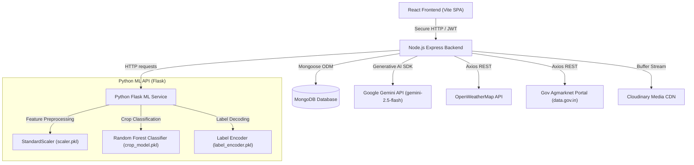

# CultivAIQ - Smart Farming Assistant System

CultivAIQ is a comprehensive, full-stack farming intelligence platform that combines **Machine Learning (ML)**, **Generative AI**, **Real-Time Web Services**, and **Secure Database Management** into a single, intuitive dashboard. 

The application is specifically designed to help farmers make data-driven agricultural decisions, optimize crop yields, monitor crop diseases, check real-time market prices, track weather conditions, and converse with an agriculture-expert AI chatbot.

---

##  System Architecture

CultivAIQ is built using a decoupled, microservices-oriented architecture to separate concerns, improve scalability, and support independent deployment of frontend, backend, and machine learning components.



---

## Tech Stack

- **Frontend**: React.js, Vite, React Router, Vanilla CSS (Premium responsive design system).
- **Backend (Express)**: Node.js, Express.js, JWT Authentication, Multer (file upload handling), Cloudinary Node SDK, Google Generative AI Node SDK, Axios, Morgan, Mongoose.
- **Machine Learning & Python Microservice (Flask)**: Python 3.x, Flask, Scikit-Learn, NumPy, Joblib (serialization/deserialization of model pipeline).
- **Database**: MongoDB (NoSQL) with Mongoose ODM.

---

##  Core Features & Technical Implementation

### 1.  ML-Powered Crop Recommendation
- **The Feature**: Recommends the optimal crop to cultivate based on seven soil and climatic parameters.
- **The Tech**: 
  - Farmers input: **Nitrogen (N)**, **Phosphorus (P)**, **Potassium (K)**, **Temperature**, **Humidity**, **Soil pH**, and **Rainfall**.
  - The Python Flask service reads the input parameters, scales them using a pre-saved `StandardScaler` (`scaler.pkl`), and feeds them into a trained `Random Forest Classifier` (`crop_model.pkl`).
  - Predictions are decoded via a pre-saved `LabelEncoder` (`label_encoder.pkl`) and returned as JSON.
  - The Express backend persists the input parameters and recommended crop in the `Recommendation` collection in MongoDB for user history.

### 2.  Agriculture-Guided AI Chatbot
- **The Feature**: An interactive chat assistant to help farmers solve crop management, pest control, and irrigation queries.
- **The Tech**: 
  - Powered by Google's **Gemini AI (`gemini-2.5-flash`)** via the `@google/generative-ai` SDK.
  - Guided by strict **System Instructions** that act as AI guardrails:
    - Restricts responses to agriculture, soil, pests, weather, and market prices.
    - Gracefully refuses irrelevant prompts (e.g. general knowledge or coding queries).
    - Format constraint: Enforces concise responses with a strict maximum of **4 short lines** to keep information digestible for field usage.
  - **Robust Fallback**: If the Gemini API key is missing or fails, the backend seamlessly routes the message to the Python Flask chatbot mock endpoint so that the chat interface remains functional. All conversation histories are saved in the `ChatMessage` collection in MongoDB.

### 3.  Crop Disease Detection
- **The Feature**: Analyzes leaf images uploaded by the farmer to identify crop diseases and provide immediate treatment advice.
- **The Tech**: 
  - The React frontend processes the leaf image as a **Base64 data URL** using the `FileReader` API.
  - This Base64 representation is sent via the Node backend to the Flask ML endpoint.
  - The API returns the diagnosed disease (e.g., *Leaf Blight*), confidence scores, and specific remediation advice (e.g., removing infected leaves, adjusting watering).
  - Diagnostics are persisted in the `Prediction` database collection.

### 4.  Real-Time Wholesale Market Prices
- **The Feature**: Displays wholesale market price fluctuations across Indian mandis.
- **The Tech**:
  - Direct integration with the **Indian Government Open Data Portal API (data.gov.in)** under Resource ID `9ef84268-d588-465a-a308-a864a43d0070`.
  - **Data Normalization Engine**: Built-in state and district name sanitization. It maps colloquial input to Agmarknet-specific casing and names (e.g. converting "tamilnadu" -> "Tamil Nadu").
  - **Search Fallback Strategy**: Executes hierarchical lookups (first matching commodity + state + district, and retrying with broader scopes if no records are found) to ensure the user always receives data.

### 5.  Geolocation-Based Weather Forecasts
- **The Feature**: Real-time current temperature, wind speed, and meteorological condition updates.
- **The Tech**:
  - Connects to the **OpenWeatherMap API** (`/weather` endpoint).
  - Supports dual queries: either using the user's current GPS Coordinates (`lat`/`lon`) or by searching a specific city.

### 6.  User Account Security & Profile Management
- **The Feature**: Secure profile settings, agricultural telemetry updates (acres owned, soil type, location, primary crop), and profile picture uploads.
- **The Tech**:
  - Secure **JWT (JSON Web Token)** Authentication. Route protection middleware (`protect`) intercepts private endpoints and validates tokens in HTTP headers.
  - Password encryption using **bcrypt** hashing.
  - Profile image uploads leverage **Multer** in-memory buffer handling and stream the file directly to **Cloudinary CDN** over SSL.

---

## 📂 Database Schemas (MongoDB / Mongoose)

- **User**: Name, unique email, encrypted password, authentication provider, photo URL, and agricultural telemetry (`acres`, `soilType`, `location`, `primaryCrop`).
- **Recommendation**: Stores historical crop recommendations (inputs: N/P/K/pH/temp/humidity/rainfall and output crop recommendation) linked to the user.
- **Prediction**: Stores diagnosed crop disease details, confidence, and treatment advice along with the image reference path.
- **ChatMessage**: Stores user messages and Gemini/Flask chatbot replies to maintain history.

---

## ⚡ Quick Start & Deployment Guide

### Prerequisites
- Node.js (v16+)
- Python (3.9+)
- MongoDB Atlas account (or local MongoDB)
- OpenWeatherMap API Key
- Indian Gov Data API Key (data.gov.in)
- Cloudinary Credentials
- Gemini API Key

---

### Step 1: Start the ML API (Python/Flask)
Runs on port `7000`.

1. Navigate to the ML API directory:
   ```bash
   cd ml-api
   ```
2. Create and activate a Python virtual environment:
   ```bash
   # Windows PowerShell
   python -m venv .venv
   .venv\Scripts\Activate.ps1
   ```
3. Install dependencies:
   ```bash
   pip install -r requirements.txt
   ```
4. Configure environment variables in `ml-api/.env`:
   ```env
   FLASK_ENV=development
   ```
5. Run the Flask server:
   ```bash
   python app.py
   ```

---

### Step 2: Start the Express Backend Server
Runs on port `5000`.

1. Navigate to the server directory:
   ```bash
   cd server
   ```
2. Install dependencies:
   ```bash
   npm install
   ```
3. Configure environment variables in `server/.env`:
   ```env
   PORT=5000
   MONGO_URI=your_mongodb_connection_string
   JWT_SECRET=your_jwt_secret_token
   
   # Cloudinary Credentials
   CLOUDINARY_CLOUD_NAME=your_cloud_name
   CLOUDINARY_API_KEY=your_api_key
   CLOUDINARY_API_SECRET=your_api_secret
   
   # External API Keys
   OPENWEATHER_API_KEY=your_open_weather_key
   DATA_GOV_API_KEY=your_india_data_gov_key
   GEMINI_API_KEY=your_gemini_api_key
   GEMINI_MODEL=gemini-2.5-flash
   
   # Microservices Link
   ML_API_URL=http://localhost:7000
   CLIENT_ORIGIN=http://localhost:5173
   ```
4. Start the backend:
   ```bash
   npm run dev
   ```

---

### Step 3: Start the React Frontend
Runs on port `5173`.

1. Navigate to the client directory:
   ```bash
   cd client/cultivaiq
   ```
2. Install dependencies:
   ```bash
   npm install
   ```
3. Configure environment variables in `client/cultivaiq/.env`:
   ```env
   VITE_API_URL=http://localhost:5000/api
   ```
4. Start the frontend dev server:
   ```bash
   npm run dev
   ```

---

##  Key Architectural Talking Points for the Interview

If asked about the project's technical decisions, highlight these aspects:

1. **Microservice Separation**:
   - *Why*: By extracting ML models to a Python Flask API and keeping UI and core business workflows in Node.js, we prevent the heavy Python ML dependencies (NumPy, Scikit-learn) from bloating the Node backend runtime. It also allows the ML API to scale independently if prediction loads increase.
2. **Generative AI Guardrails & Prompt Engineering**:
   - *Why*: Letting users chat with an open model is a security and utility risk. By defining a strict system instruction on the Gemini API, the AI's persona is limited to agriculture, keeping tokens small and keeping responses highly focused (concise, max 4 lines), saving API costs and tailoring outputs for quick reading on mobile screens in the field.
3. **Data Normalization & Fallbacks**:
   - *Why*: Real-world public APIs (like Indian government records) can be messy, with unexpected variations in case, space, or naming formats. The backend implements a robust **normalization layer** to clean user inputs, matching them to Agmarknet formats. It also has a nested search fallback strategy (falling back to broader queries if narrow filters yield zero records).
4. **Efficient Media Management**:
   - *Why*: Handling files in backend Node servers can exhaust server RAM. For profile photos, we use **Multer in-memory buffers** and pipe them directly into **Cloudinary uploader streams**, ensuring files are uploaded to the CDN without saving temporary files to the backend server disk.
5. **Robust ML Processing Pipeline**:
   - *Why*: Many developers feed raw values directly into ML models. Here, the Flask API uses a pre-saved `StandardScaler` object to scale features first, ensuring the input values match the distribution of the dataset the model was trained on, avoiding model bias and incorrect crop recommendations.
